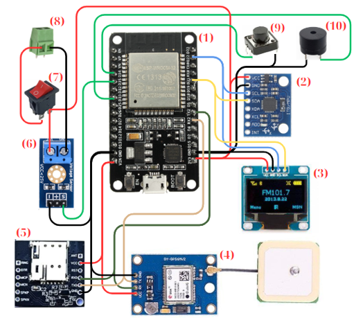

# ESP32 MPU Project

This repository is to create a IoT device that can detect real-time fall detection for elderly embedded on this device.

## Features

- Feature extractions from MPU6050 sensors.
- Real-time fall detection using SVM classification.
- On-device inference for immediate response.
- Notifications family members in case of a hard fall.
- Other features: GPS, 4G SIM card along with Wi-Fi connection, buzzer intergrated, battery intergrated, OLED Display and battery percentage measurement.

## Getting Started

### Prerequisites

- ESP32 development board
- Sensors/Accessory: MPU6050, Battery, Switch, GPS antenna, SIM kit, Battery voltage measuring circut, Buzzer, OLED Display.
- Arduino IDE
- Python 3 (for SVM training and inference scripts)
- Required Python libraries: `scikit-learn`, `numpy`, `pandas` (for SVM)
- Libraries to install: `Adafruit_MPU6050`, `Adafruit_Sensor`, `NTPClient`, `ArduinoJson`, `U8g2lib`, and some other library that already came with ESP32 Core and Arduino IDE.


### Installation

1. Clone this repository:
   ```bash
   git clone https://github.com/tungBKDN/esp32_mpu.git
   ```
2. Open the project in your preferred IDE, use ESP32S2 Board if using ArduinoIDE.
3. Install required required library above.

### Wiring Guide


With:
| #  | Component            | #  | Component           |
|----|----------------------|----|---------------------|
| 1  | ESP32                | 6  | Cảm biến điện áp    |
| 2  | MPU6050              | 7  | Công tắc nguồn      |
| 3  | Màn hình Oled        | 8  | Domino nối nguồn    |
| 4  | GPS Neo6M            | 9  | Nút bấm tắt loa     |
| 5  | Module SIM           | 10 | Loa                 |


## About this Custom SVM
The SVM Model comes with `scale.h`, `support_vectors.h` and `train_value.h` which contain parameters of the SVM. These parameter is previously extracted from the training stage in Python.
The dimension of the support vectors is: 22 vectors x 54 features.

## SVM Example

The directory works like this:
- Preprocessing sensor data
- Training an SVM classifier to recognize different activities (e.g., walking, running, stationary)
- Exporting the trained model for use on the ESP32 or for offline analysis

## License

This project is licensed under the MIT License.

## Acknowledgements

- [ESP32 Arduino Core](https://github.com/espressif/arduino-esp32)
- [MPU6050 Library](https://github.com/jrowberg/i2cdevlib)
- [scikit-learn](https://scikit-learn.org/)
